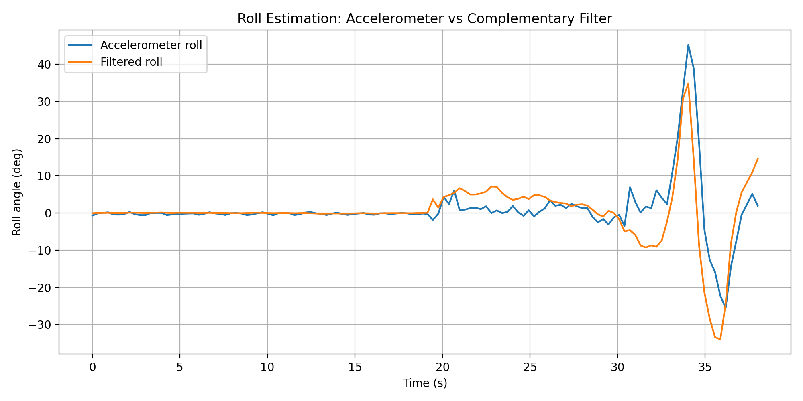
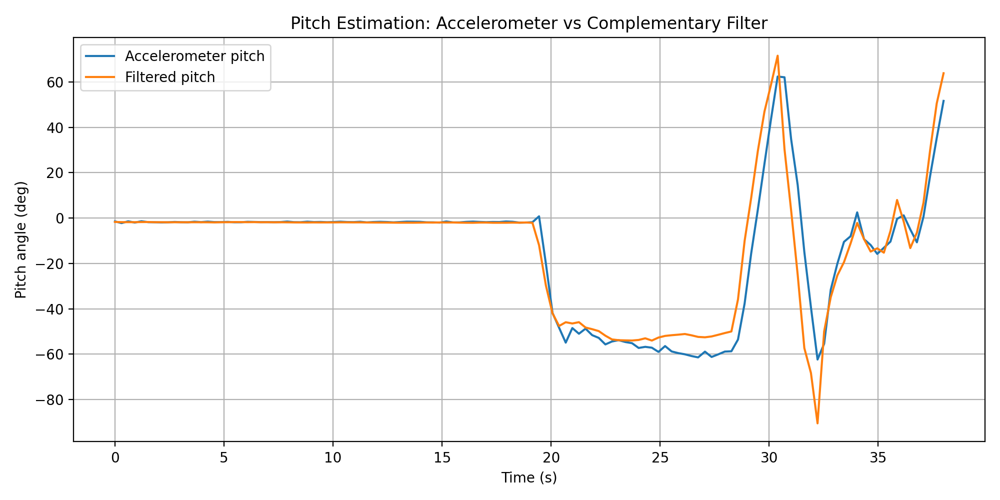
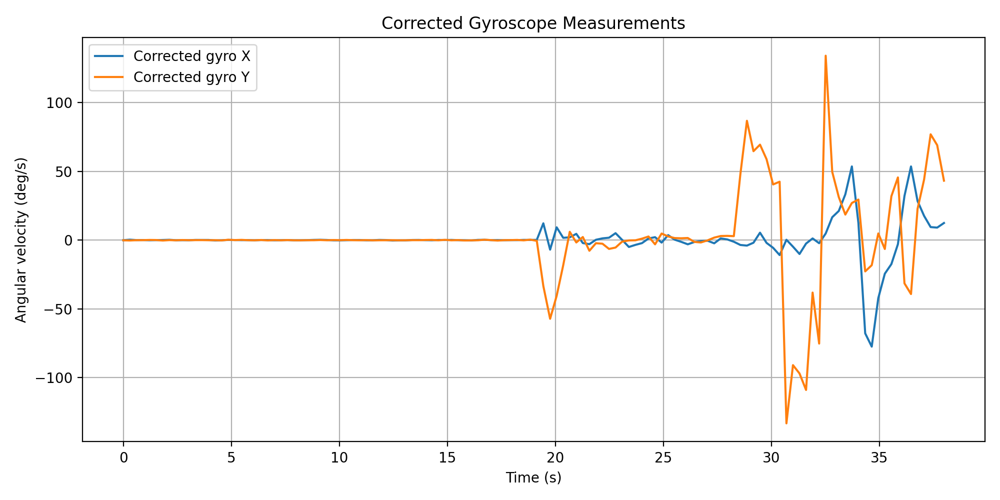

# Embedded IMU Attitude Estimation

ESP32-based attitude estimation project using an MPU6050 IMU sensor.

This project estimates board orientation using real accelerometer and gyroscope data. It is designed as a practical bridge between simulation-based state estimation and embedded hardware sensing.

## Portfolio Context

This project is part of an Intelligent Physical Systems portfolio focused on:

- embedded sensing
- real sensor data
- inertial measurement
- filtering and estimation
- hardware-in-the-loop experimentation
- robotics and aerospace-inspired orientation estimation

## Project Goal

The goal is to estimate roll and pitch angles from an MPU6050 IMU connected to an ESP32.

The project will start with raw IMU reading and then progress toward filtered attitude estimation.

## Planned Stages

1. Read raw accelerometer and gyroscope data from MPU6050
2. Compute roll and pitch from accelerometer measurements
3. Study gyroscope drift and accelerometer noise
4. Implement a complementary filter for stable roll/pitch estimation
5. Log serial data for Python analysis
6. Plot raw and filtered attitude estimates
7. Add OLED live display as a hardware output

## Hardware

Initial hardware:

- ESP32 development board
- MPU6050 / GY-521 IMU module
- Breadboard
- Jumper wires
- USB cable

Planned extension:

- OLED display for live roll/pitch visualization

## Wiring

Initial ESP32 to MPU6050 wiring:

| MPU6050 Pin | ESP32 Pin |
|---|---|
| VCC | 3V3 |
| GND | GND |
| SDA | GPIO 21 |
| SCL | GPIO 22 |

## Project Structure

embedded-imu-attitude-estimation/
- firmware/
  - esp32_i2c_scanner/
  - esp32_mpu6050_raw_reading/
  - esp32_mpu6050_accel_angles/
  - esp32_mpu6050_complementary_filter/
- docs/
  - wiring.md
  - i2c_test.md
  - raw_reading.md
  - accelerometer_angles.md
  - complementary_filter.md
  - imu_logging_analysis.md
- data/
  - raw/
- results/
  - roll_estimation_comparison.png
  - pitch_estimation_comparison.png
  - corrected_gyro_measurements.png
  - imu_demo_summary.csv
- scripts/
  - log_imu_demo.py
  - clean_imu_log.py
  - plot_imu_log.py
- README.md
- requirements.txt
- .gitignore

## Hardware Bring-Up

The first hardware bring-up test was completed using an ESP32 I2C scanner.

Result:

MPU6050 detected at I2C address 0x68

This confirms that the soldered MPU6050 module, wiring, and ESP32 I2C communication are working correctly.

See:

[docs/i2c_test.md](docs/i2c_test.md)

## Raw IMU Reading

The second hardware test reads raw accelerometer and gyroscope data from the MPU6050.

Initial stationary readings showed:

- accel_z approximately 1.01 g
- accel_x and accel_y close to 0 g
- gyroscope values close to zero with small bias/noise

This confirms that raw IMU data streaming is working correctly.

See:

[docs/raw_reading.md](docs/raw_reading.md)

## Accelerometer-Based Roll/Pitch

The third hardware test computes roll and pitch angles from MPU6050 accelerometer measurements.

Flat-on-desk readings were close to:

- roll: about -0.2 to -0.6 degrees
- pitch: about -1.5 to -2.1 degrees
- accel_z: about 1.01 g

When the board was tilted by hand, roll changed clearly from about +44 degrees to about -44 degrees.

This confirms that the ESP32 can compute physical board orientation from real IMU acceleration data.

See:

[docs/accelerometer_angles.md](docs/accelerometer_angles.md)

## Complementary Filter

The fourth hardware test combines accelerometer-based roll/pitch estimates with gyroscope measurements using a complementary filter.

A startup gyroscope calibration step was added because the stationary gyro readings had small bias. After calibration, the corrected gyroscope values stayed close to zero when the board was still.

Stationary test results showed stable filtered roll and pitch estimates. During tilted tests, the filtered pitch estimate followed the physical board orientation.

See:

[docs/complementary_filter.md](docs/complementary_filter.md)

## Serial Logging and Python Analysis

The fifth project stage logs complementary-filter attitude estimates from the ESP32 over Serial and analyzes the recorded data with Python.

A demo log was collected with three stages:

- flat on desk
- tilted and held still
- slowly rotated / tilted by hand

The cleaned dataset contains 126 samples over approximately 38 seconds.

Generated outputs include:

- roll estimation comparison plot
- pitch estimation comparison plot
- corrected gyroscope measurement plot
- IMU demo summary CSV

See:

[docs/imu_logging_analysis.md](docs/imu_logging_analysis.md)

## Results and Plots

The project includes Python-based analysis plots generated from real ESP32 + MPU6050 Serial logs.

### Roll Estimation

This plot compares accelerometer-only roll estimation with the complementary-filter roll estimate.

### Pitch Estimation

This plot compares accelerometer-only pitch estimation with the complementary-filter pitch estimate.

### Corrected Gyroscope Measurements

This plot shows calibrated gyroscope measurements after startup bias correction.

### Demo Summary

The logged demo contains:

| Metric | Value |
|---|---:|
| Samples | 126 |
| Duration | 38.0 s |
| Filtered roll range | -34.0° to +34.8° |
| Filtered pitch range | -90.5° to +71.6° |

## Current Status

Initial hardware bring-up, raw IMU reading, accelerometer-based roll/pitch estimation, complementary filtering, Serial logging, and Python analysis are complete. The ESP32 successfully detected the MPU6050 at I2C address 0x68, streamed accelerometer/gyroscope measurements over Serial, computed board orientation, combined accelerometer and gyroscope measurements using a complementary filter with startup gyro calibration, and generated analysis plots from real IMU logs. The next step is to improve sampling rate and prepare for live OLED attitude display.
