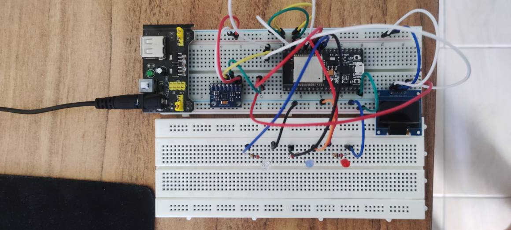
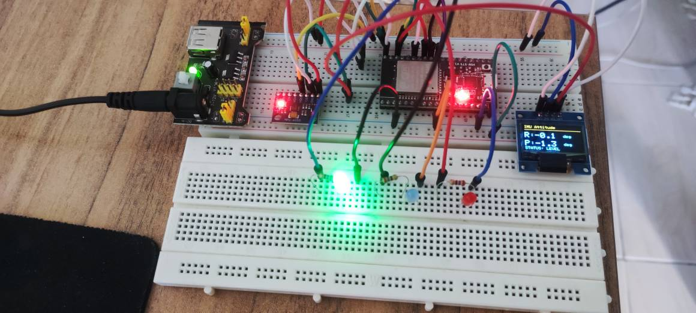
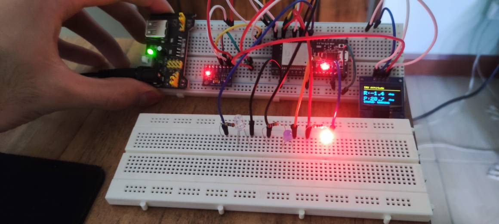
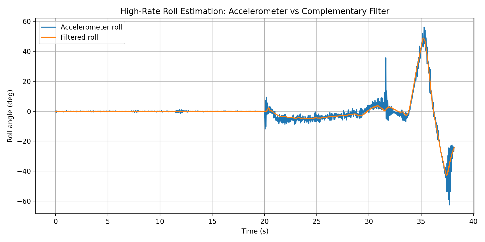
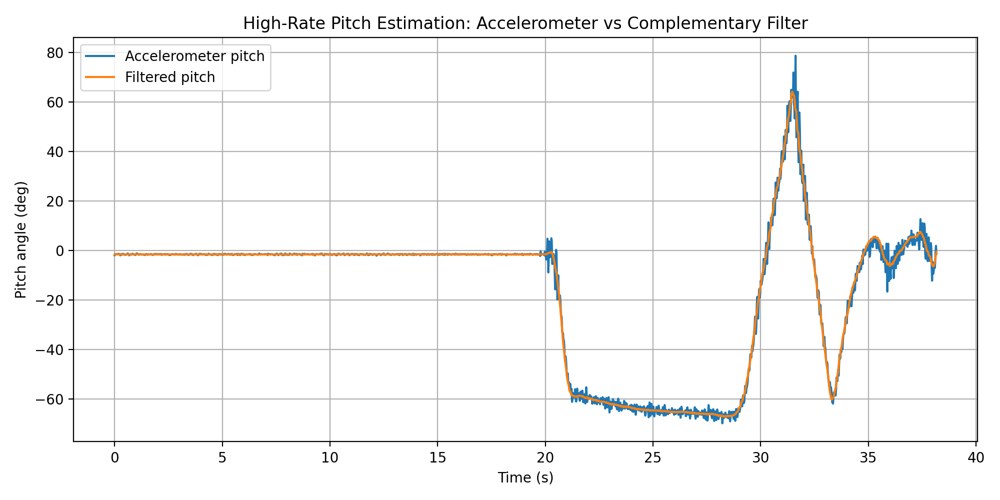
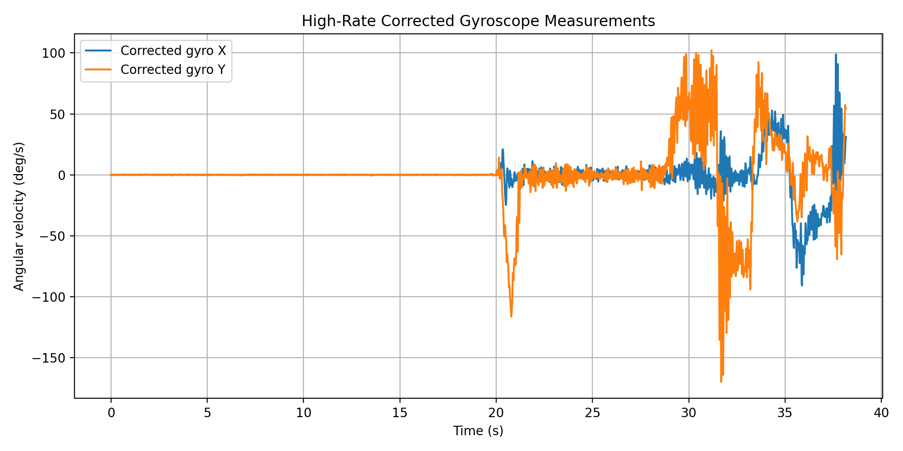
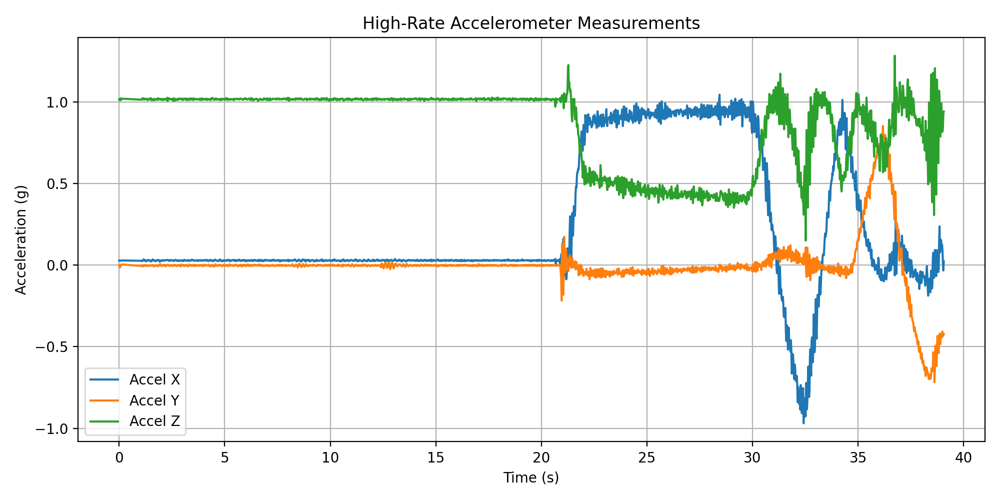
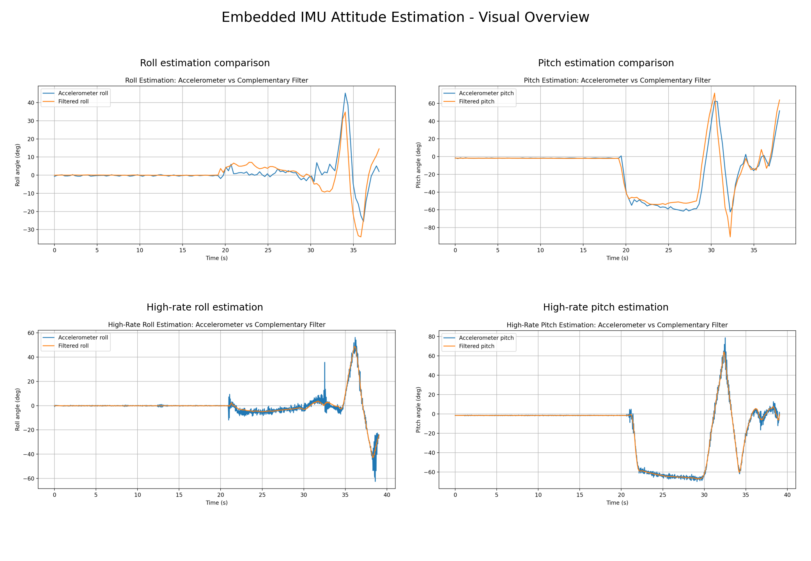
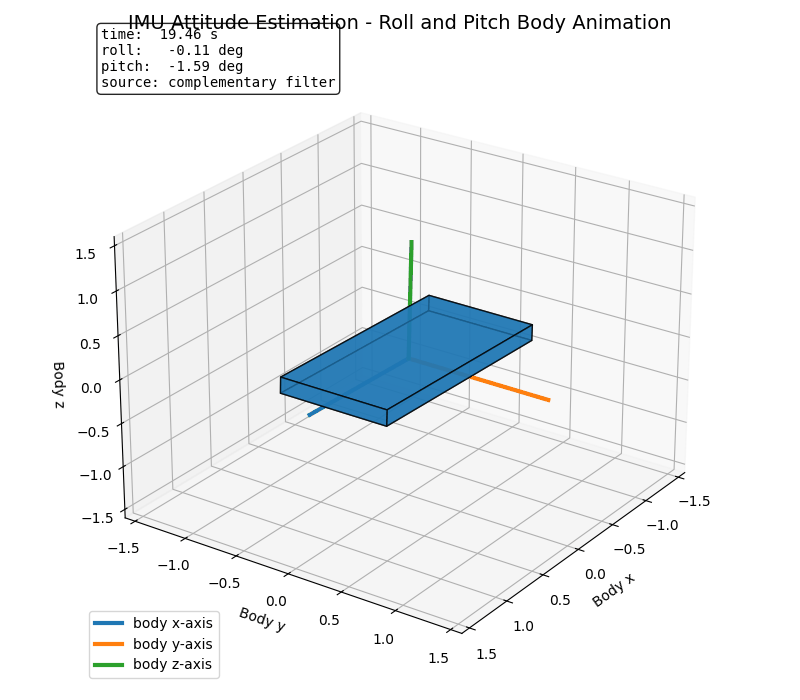

# Embedded IMU Attitude Estimation

I built this project to turn raw MPU6050 accelerometer and gyroscope readings into a visible roll/pitch attitude demo on an ESP32.

The project started with basic sensor bring-up and gradually became a small embedded estimation pipeline: I2C detection, raw IMU reading, accelerometer angle calculation, complementary filtering, Serial logging, Python analysis, OLED display output, LED status feedback, and hardware demo media.

The most useful engineering lesson was the gyroscope calibration step. The stationary gyro readings were close to zero, but not exactly zero, so the filter needed a startup bias estimate before the roll and pitch outputs became stable enough for the OLED demo.

Main pieces:

- ESP32 + MPU6050 hardware bring-up
- raw accelerometer and gyroscope reading
- accelerometer-based roll/pitch calculation
- complementary filter for stable attitude estimation
- high-rate Serial logging at about 50 Hz
- Python cleaning and plotting scripts
- OLED live roll/pitch display
- LED status feedback for attitude state
- hardware photos and demo video

---

## What I built

The goal is to estimate roll and pitch angles from an MPU6050 IMU connected to an ESP32, then show the estimator as a physical embedded demo.

I used the accelerometer for gravity-based roll/pitch estimates and the gyroscope for short-term motion response. The complementary filter combines both: the gyro reacts quickly, while the accelerometer helps correct drift over time.

The project progressed from basic sensor tests to a visible hardware demo with OLED and LED feedback.

## Completed Stages

1. Read raw accelerometer and gyroscope data from MPU6050
2. Compute roll and pitch from accelerometer measurements
3. Study gyroscope drift and accelerometer noise
4. Implement a complementary filter for stable roll/pitch estimation
5. Log Serial data for Python analysis
6. Plot raw and filtered attitude estimates
7. Add high-rate CSV logging for cleaner engineering data
8. Add OLED live roll/pitch display
9. Add LED status feedback for attitude state
10. Add hardware photos and demo video

## Hardware

Final hardware setup:

- ESP32 development board
- MPU6050 / GY-521 IMU module
- SSD1306 I2C OLED display
- Green, blue, and red LED status indicators
- Breadboard
- Jumper wires
- USB cable

## Wiring

Initial ESP32 to MPU6050 wiring:

| MPU6050 Pin | ESP32 Pin |
|---|---|
| VCC | 3V3 |
| GND | GND |
| SDA | GPIO 21 |
| SCL | GPIO 22 |

## Project Structure

embedded-imu-attitude-estimation/
- firmware/
  - esp32_i2c_scanner/
  - esp32_mpu6050_raw_reading/
  - esp32_mpu6050_accel_angles/
  - esp32_mpu6050_complementary_filter/
  - esp32_mpu6050_high_rate_logger/
  - esp32_mpu6050_oled_attitude_display/
- docs/
  - wiring.md
  - i2c_test.md
  - raw_reading.md
  - accelerometer_angles.md
  - complementary_filter.md
  - imu_logging_analysis.md
  - oled_attitude_display.md
- data/
  - raw/
  - processed/
- results/
  - roll_estimation_comparison.png
  - pitch_estimation_comparison.png
  - corrected_gyro_measurements.png
  - imu_demo_summary.csv
  - high_rate_roll_estimation_comparison.png
  - high_rate_pitch_estimation_comparison.png
  - high_rate_corrected_gyro_measurements.png
  - high_rate_accelerometer_measurements.png
  - high_rate_imu_demo_summary.csv
  - attitude_estimation_visual_overview.png
  - attitude_body_animation.gif
- scripts/
  - log_imu_demo.py
  - clean_imu_log.py
  - plot_imu_log.py
  - clean_high_rate_imu_log.py
  - plot_high_rate_imu_log.py
  - create_visual_overview.py
  - animate_attitude_body.py
- README.md
- requirements.txt
- .gitignore

## Reproducing the Python Analysis

The analysis environment used for the current results was Python 3.12.7.

```bash
python -m venv venv
source venv/bin/activate
python -m pip install -r requirements.txt

python scripts/clean_imu_log.py
python scripts/plot_imu_log.py

python scripts/clean_high_rate_imu_log.py
python scripts/plot_high_rate_imu_log.py

python scripts/create_visual_overview.py
python scripts/animate_attitude_body.py
```

Raw captures are kept under `data/raw/`, while cleaned datasets are written to `data/processed/`.

For the embedded firmware, the project uses the ESP32 Arduino core. The OLED stage additionally uses Adafruit GFX and Adafruit SSD1306; I2C communication uses the Arduino `Wire` library.

## Hardware Bring-Up

The first hardware bring-up test was completed using an ESP32 I2C scanner.

Result:

MPU6050 detected at I2C address 0x68

This confirms that the soldered MPU6050 module, wiring, and ESP32 I2C communication are working correctly.

See:

[docs/i2c_test.md](docs/i2c_test.md)


## Raw IMU Reading

The second hardware test reads raw accelerometer and gyroscope data from the MPU6050.

Initial stationary readings showed:

- accel_z approximately 1.01 g
- accel_x and accel_y close to 0 g
- gyroscope values close to zero with small bias/noise

This confirms that raw IMU data streaming is working correctly.

See:

[docs/raw_reading.md](docs/raw_reading.md)


## Accelerometer-Based Roll/Pitch

The third hardware test computes roll and pitch angles from MPU6050 accelerometer measurements.

Flat-on-desk readings were close to:

- roll: about -0.2 to -0.6 degrees
- pitch: about -1.5 to -2.1 degrees
- accel_z: about 1.01 g

When the board was tilted by hand, roll changed clearly from about +44 degrees to about -44 degrees.

The measured roll and pitch changed consistently with manual board tilting during the hardware test.

See:

[docs/accelerometer_angles.md](docs/accelerometer_angles.md)


## Complementary Filter

The fourth hardware test combines accelerometer-based roll/pitch estimates with gyroscope measurements using a complementary filter.

A startup gyroscope calibration step was added because the stationary gyro readings had small bias. After calibration, the corrected gyroscope values stayed close to zero when the board was still.

Stationary test results showed stable filtered roll and pitch estimates. During manual tilt tests, the filtered pitch estimate responded consistently to the applied motion.

See:

[docs/complementary_filter.md](docs/complementary_filter.md)


## Serial Logging and Python Analysis

The fifth project stage logs complementary-filter attitude estimates from the ESP32 over Serial and analyzes the recorded data with Python.

A demo log was collected with three stages:

- flat on desk
- tilted and held still
- slowly rotated / tilted by hand

The cleaned dataset contains 126 samples over approximately 38 seconds.

Generated outputs include:

- roll estimation comparison plot
- pitch estimation comparison plot
- corrected gyroscope measurement plot
- IMU demo summary CSV

See:

[docs/imu_logging_analysis.md](docs/imu_logging_analysis.md)


## High-Rate IMU Logging

After the initial human-readable Serial demo, a separate high-rate logging firmware was added for cleaner data collection.

The high-rate logger outputs CSV-formatted IMU and complementary-filter data at approximately 50 Hz. This improves the data quality compared with the earlier slow Serial demo and makes the project more suitable for engineering analysis.

High-rate logging files:

- firmware: `firmware/esp32_mpu6050_high_rate_logger/esp32_mpu6050_high_rate_logger.ino`
- raw log: `data/raw/high_rate_imu_demo_log.csv`
- cleaned CSV: `data/processed/high_rate_imu_demo_clean.csv`
- cleaning script: `scripts/clean_high_rate_imu_log.py`
- plotting script: `scripts/plot_high_rate_imu_log.py`

High-rate demo summary:

| Metric | Value |
|---|---:|
| Samples | 1907 |
| Capture duration | 39.06 s |
| Mean reported timestep | 0.020 s |
| Nominal update rate | 50.0 Hz |
| Effective logged row rate | 48.80 Hz |
| Filtered roll range | -43.1° to +48.8° |
| Filtered pitch range | -67.1° to +64.1° |

This stage made the data easier to analyze because the logger moved from a slower human-readable Serial format to cleaner CSV-style output at about 50 Hz.

## OLED Live Attitude Display

A live OLED display and simple LED status indicator stage was added to turn the estimator into a visible embedded hardware demo.

The OLED and MPU6050 share the same ESP32 I2C bus:

| Device | I2C Address |
|---|---:|
| OLED SSD1306 display | `0x3C` |
| MPU6050 IMU | `0x68` |

The display firmware is located at:

`firmware/esp32_mpu6050_oled_attitude_display/esp32_mpu6050_oled_attitude_display.ino`

The OLED shows live complementary-filter attitude estimates:

- `R`: filtered roll angle in degrees
- `P`: filtered pitch angle in degrees
- `STATUS`: threshold-based attitude state

The LEDs provide quick visual feedback:

| Status | Condition | LED |
|---|---|---|
| `LEVEL` | max tilt < 10° | Green |
| `TILT` | 10° <= max tilt < 25° | Blue |
| `WARNING` | max tilt >= 25° | Red |

These thresholds are demonstration logic for the hardware interface, not calibrated safety limits.

Flat-on-desk test result:

| Quantity | Value |
|---|---:|
| Roll | -0.1° |
| Pitch | -1.8° |

Small offsets around zero are expected due to sensor bias, physical alignment, and the surface not being perfectly level.

This stage turned the estimator from a Serial-only experiment into a visible embedded demo with live OLED values and LED status feedback.

## Hardware Demo

The final embedded demo combines:

- ESP32
- MPU6050 / GY-521 IMU
- SSD1306 I2C OLED display
- green, blue, and red LED status indicators

The OLED displays live complementary-filter roll and pitch estimates, while the LEDs provide quick threshold-based status feedback:

| Status | Meaning | LED |
|---|---|---|
| `LEVEL` | near-level attitude | Green |
| `TILT` | moderate tilt | Blue |
| `WARNING` | high tilt | Red |

### Demo Video

[Watch the IMU OLED + LED attitude demo](docs/media/imu_oled_led_attitude_demo.mp4)

### Hardware Overview



### LEVEL State



### WARNING State



See:

[docs/oled_attitude_display.md](docs/oled_attitude_display.md)

## Results and Plots

The project includes Python-based analysis plots generated from real ESP32 + MPU6050 Serial logs.

### High-Rate Roll Estimation

This plot compares accelerometer-only roll estimation with the complementary-filter roll estimate using the 50 Hz logger.



### High-Rate Pitch Estimation

This plot compares accelerometer-only pitch estimation with the complementary-filter pitch estimate using the 50 Hz logger.



### High-Rate Corrected Gyroscope Measurements

This plot shows calibrated gyroscope measurements from the high-rate logger.



### High-Rate Accelerometer Measurements

This plot shows the raw accelerometer axes during the high-rate motion demo.



### Initial Roll Estimation

This plot compares accelerometer-only roll estimation with the complementary-filter roll estimate.


### Initial Pitch Estimation

This plot compares accelerometer-only pitch estimation with the complementary-filter pitch estimate.


### Initial Corrected Gyroscope Measurements

This plot shows calibrated gyroscope measurements after startup bias correction.


### Demo Summary

The logged demo contains:

| Metric | Value |
|---|---:|
| Samples | 126 |
| Duration | 38.0 s |
| Filtered roll range | -34.0° to +34.8° |
| Filtered pitch range | -90.5° to +71.6° |


## Limitations

- The estimator provides roll and pitch only; yaw is not observable with the MPU6050 alone because there is no magnetometer or other heading reference.
- No external ground-truth angle sensor was used, so the plots demonstrate estimator behavior rather than absolute orientation accuracy.
- Accelerometer-based tilt assumes gravity is the dominant acceleration; strong linear motion can disturb the angle estimate.
- Gyroscope bias is estimated only at startup and may change with temperature or time.
- The complementary-filter coefficient is fixed at `alpha = 0.98`. Because the early demo and the 50 Hz logger use different update rates, that coefficient does not imply identical time-domain filter behavior in both stages.
- The OLED/LED attitude thresholds are demonstration values rather than safety or control-system limits.

## Visual overview

The figure below summarizes the main attitude estimation outputs, including roll and pitch estimation results from the IMU logging experiments.



### Attitude Body Animation

The animation below visualizes the filtered roll and pitch estimates as the orientation of a simple 3D body. The static beginning of the recording is skipped so the demo starts near the first meaningful attitude change.


